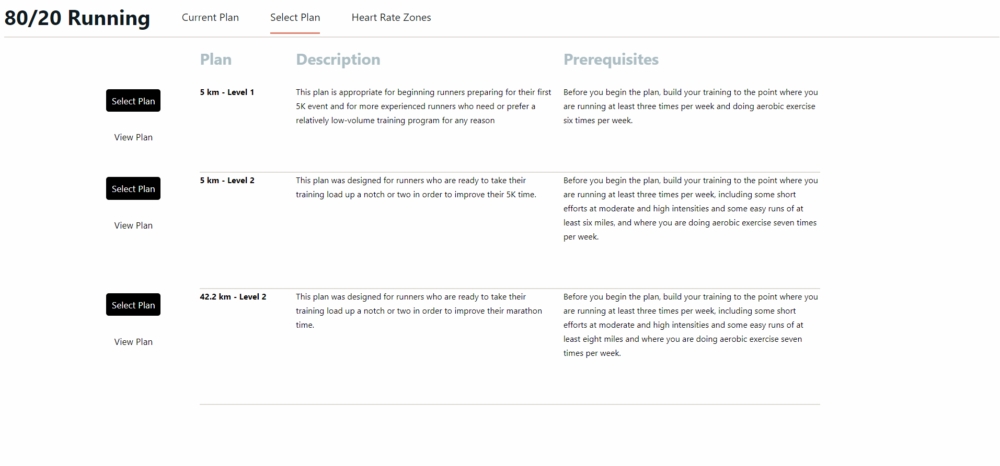

# About this project

See context <a href="https://www.uddsten.com/2023/01/22/i-built-a-web-app-to-track-running-plans/">here</a>

<h4>Browsing plans and selecting a plan</h4>

<h4>Viewing a plan (double-click marks workout as complete)</h4>

<h4>Updating heart rate zones based on lactate threshold</h4>

